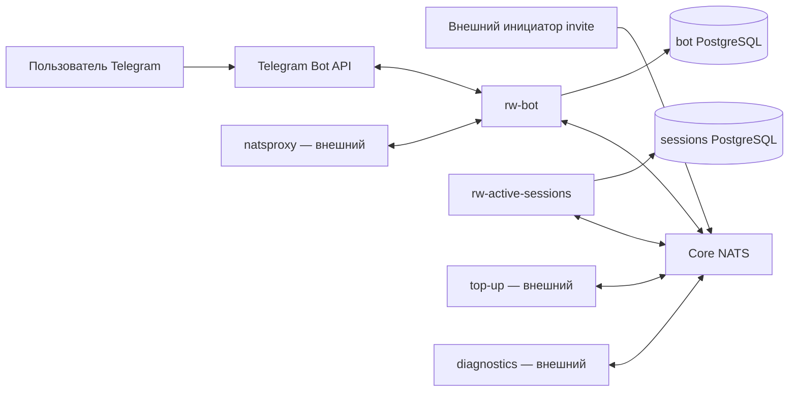
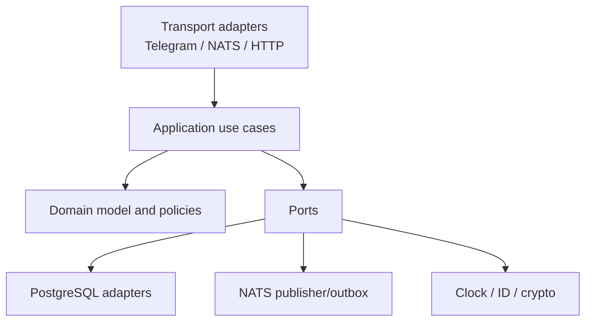

# Архитектура системы

## Контекст



## Контейнеры

| Компонент | Ответственность | Масштабирование | Stateful dependency |
| --- | --- | --- | --- |
| `rw-bot` | Telegram UI, invites, inactive flow, activation orchestration, active projection | Горизонтально; webhook и NATS consumers через queue groups | Bot PostgreSQL |
| `rw-active-sessions` | Авторитетные active sessions, первый sender wallet, повторная top-up проверка, list/revoke | Горизонтально; NATS consumers через queue groups | Sessions PostgreSQL |
| `migration` jobs | Последовательное применение forward migrations | Один job на БД перед rollout | Соответствующая PostgreSQL |
| Local fakes | Top-up, diagnostics, natsproxy/Telegram stubs | Только dev/CI | In-memory или тестовая БД |

## Внутренняя структура каждого сервиса



- Domain не импортирует NATS, Telegram SDK, SQL driver или DTO транспорта.
- Application управляет транзакциями и orchestration, но не сериализацией.
- Adapters преобразуют внешние DTO в команды application layer.
- Shared packages допускаются только для стабильного публичного protocol/telemetry кода; доменные модели сервисов не объединяются.

## Владение данными

| Данные | Авторитет | Допустимая копия |
| --- | --- | --- |
| Invite и его consumption | Bot DB | Нет |
| Telegram update checkpoint/dedup | Bot DB | Нет |
| Inactive session и dialog state | Bot DB | Нет |
| Activation attempt до подтверждения | Bot DB | Active-sessions хранит только verification request |
| Первый sender wallet для balance ID | Sessions DB | Маскированная projection в bot DB при необходимости |
| Active/revoked session | Sessions DB | Bot projection, обновляемая только авторитетными events |
| Top-up/finality | Внешний top-up | Только ссылки/результаты, необходимые для аудита |

Прямой доступ одного сервиса к БД другого запрещён.

## Целевая структура репозитория

```text
cmd/
  rw-bot/
  rw-active-sessions/
internal/
  bot/{domain,app,adapter}/
  sessions/{domain,app,adapter}/
  platform/{config,postgres,nats,crypto,observability}
contracts/
  asyncapi/
  schemas/
  fixtures/
migrations/
  bot/
  sessions/
deploy/
  docker/
  compose/
docs/
  project/            # рабочая русскоязычная документация
  *.txt               # исходное место пользовательских документов
raw/                  # immutable sources
wiki/                 # локальная техническая память, не публикуется
```

## Развёртывание

- Локально: Docker Compose поднимает PostgreSQL x2, NATS, оба сервиса и fakes; Telegram можно заменить stub или включить direct long polling.
- Production: отдельные deployments, service accounts и NATS ACL; migrations запускаются pre-deploy job; webhook ingress включается только в direct-webhook mode.
- Масштабирование stateless replicas не должно менять результат: вся coordination выполняется через PostgreSQL constraints/row locks и идемпотентные сообщения.
- Readiness означает готовность принимать конкретный workload: установлено подключение к БД, миграции совместимы, NATS subscriptions активны; для webhook дополнительно готов HTTP listener.
- Liveness не зависит от временной недоступности внешнего top-up/Telegram, чтобы не создавать restart loop.

Telegram `getUpdates` и webhook взаимоисключающие; pending updates хранятся Telegram не дольше 24 часов. Это учитывается в transport switch runbook: [Telegram Bot API](https://core.telegram.org/bots/api#getting-updates).

## Архитектурные запреты

- Нет NATS Request/Reply и JetStream.
- Нет распределённых транзакций между БД.
- Нет синхронного ожидания NATS-result внутри HTTP/Telegram handler.
- Нет состояния workflow только в памяти.
- Нет использования Telegram ID как внутреннего primary key.
- Нет hard delete активной сессии или activation audit в обычном пользовательском сценарии.
