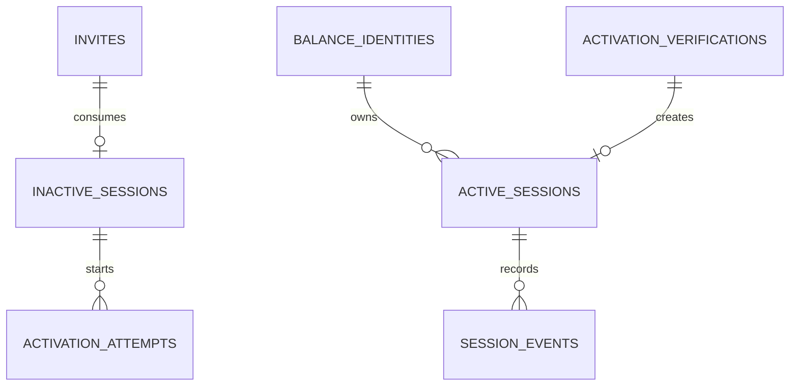

# Модель данных PostgreSQL

Статус: `УТВЕРЖДЁННАЯ ЛОГИЧЕСКАЯ СХЕМА V1`. DDL обязан сохранять перечисленные поля, ownership и constraints; физические имена вспомогательных индексов определяются миграциями.

## Общие правила

- Все timestamps — `timestamptz` UTC.
- Внутренние идентификаторы — application-generated UUIDv7.
- Внешние идентификаторы хранятся как ограниченный `text`, не как integer, если контракт не гарантирует тип.
- Состояния — `text + CHECK`, а не PostgreSQL enum, чтобы облегчить rolling migrations.
- Денежные значения — `numeric(38, scale)` с обязательным configured scale; в wire — decimal string.
- Sensitive values шифруются AES-256-GCM с key ID; lookup/compare выполняется по HMAC-SHA-256 fingerprint. Raw invite хранится только как SHA-256 digest, кроме временного encrypted result envelope.
- Каждая изменяемая state-machine запись имеет `version bigint` для optimistic compare-and-set.

## База данных бота

### `invites`

| Колонка | Тип | Null | Ограничение/назначение |
| --- | --- | --- | --- |
| `id` | uuid | нет | PK |
| `operation_id` | uuid | нет | UNIQUE, идемпотентность create command |
| `token_digest` | bytea | нет | UNIQUE, SHA-256 token |
| `token_ciphertext` | bytea | нет | Raw token для идемпотентного result, AES-256-GCM |
| `balance_id_ciphertext`, `balance_id_fingerprint` | bytea | нет | Encrypted opaque ID + indexed HMAC lookup |
| `status` | text | нет | `ACTIVE/CONSUMED/EXPIRED` |
| `expires_at` | timestamptz | нет | Default 24h, allowed 5m–7d |
| `consumed_by_session_id` | uuid | да | FK на inactive session |
| `consumed_at` | timestamptz | да | Set atomically |
| `command_message_id`, `result_message_id` | uuid | нет | Связь с durable inbox/outbox |
| `created_at` | timestamptz | нет | Audit |

Indexes: unique digest, unique operation, cleanup `(status, expires_at)`.

### `inactive_sessions`

| Колонка | Тип | Null | Ограничение/назначение |
| --- | --- | --- | --- |
| `id` | uuid | нет | PK, stable session ID |
| `bot_id` | bigint | нет | Telegram bot identity |
| `balance_id_ciphertext`, `balance_id_fingerprint` | bytea | нет | Immutable encrypted binding + lookup |
| `telegram_user_id` | bigint | нет | Telegram identity |
| `telegram_chat_id` | bigint | нет | Private chat identity |
| `dialog_state` | text | нет | State machine value |
| `current_attempt_id` | uuid | да | FK activation attempts |
| `created_at`, `updated_at`, `expires_at` | timestamptz | нет | Lifecycle |
| `version` | bigint | нет | CAS |

Partial unique constraint: одна non-terminal binding на `(bot_id, telegram_user_id)`. `telegram_chat_id` обновляется как адрес доставки и не участвует в identity; terminal row не блокирует новую binding.

### `activation_attempts`

| Колонка | Тип | Null | Ограничение/назначение |
| --- | --- | --- | --- |
| `id` / `operation_id` | uuid | нет | PK / UNIQUE correlation |
| `session_id` | uuid | нет | Stable inactive/authority session ID |
| `status` | text | нет | Reservation/payment/verification lifecycle |
| `sender_wallet_ciphertext`, `sender_wallet_fingerprint` | bytea | нет | Submitted canonical encrypted value + lookup |
| `network`, `asset` | text | нет | Required contract values; asset=`USDT` |
| `verification_amount` | text | нет | Exact decimal amount без float |
| `external_reservation_id` | text | да | Top-up identifier |
| `receiver_wallet_ciphertext`, `receiver_wallet_fingerprint` | bytea | да | Encrypted offer result + lookup |
| `offer_expires_at` | timestamptz | да | Late-event guard |
| `transaction_id` | text | да | UNIQUE per network where appropriate |
| `failure_code` | text | да | User/recovery flow |
| `created_at`, `updated_at`, `completed_at` | timestamptz | да | Audit |
| `version` | bigint | нет | CAS |

Constraints/indexes: один non-terminal attempt на session; unique `(network, transaction_id)` when present; `(status, updated_at)` для reconciliation.

### `active_session_projection`

| Колонка | Тип | Null | Назначение |
| --- | --- | --- | --- |
| `session_id` | uuid | нет | PK, same ID as authority |
| `balance_id_fingerprint` | bytea | нет | Routing lookup only; raw value не нужен UI |
| `bot_id` | bigint | нет | Telegram bot identity |
| `telegram_user_id`, `telegram_chat_id` | bigint | нет | Local matching |
| `authority_version` | bigint | нет | Ignore stale events |
| `activated_at`, `updated_at` | timestamptz | нет | Projection metadata |

Bot всегда запрашивает active-sessions для авторитетных list/revoke; projection используется только как быстрый access gate и для UI routing.

### `telegram_updates`

| Колонка | Тип | Ограничение/назначение |
| --- | --- | --- |
| `transport` | text | Composite PK part |
| `update_id` | bigint | Composite PK part, dedup |
| `received_at`, `processed_at` | timestamptz | Processing audit |
| `status`, `failure_code` | text | Recovery |
| `payload_digest` | bytea | Audit/dedup без raw payload |

Raw Telegram payload не сохраняется: handler выполняет bounded parsing и domain transaction до ответа 2xx/продвижения polling offset.

### `telegram_deliveries`

| Колонка | Тип | Ограничение/назначение |
| --- | --- | --- |
| `operation_id` | uuid | PK, stable notification/call ID |
| `session_id`, `chat_id` | uuid/bigint | Delivery target |
| `method` | text | Allowlisted Bot API method |
| `request_ciphertext`, `encryption_key_id` | bytea/text | Exact request encrypted at rest |
| `status` | text | `PENDING/SENDING/SENT/FAILED/OUTCOME_UNKNOWN` |
| `telegram_message_id` | bigint | Result when Telegram returned it |
| `attempts`, `next_attempt_at` | int/timestamptz | Retry policy |
| `created_at`, `sent_at`, `updated_at` | timestamptz | Audit |

`sendMessage` не повторяется автоматически после `OUTCOME_UNKNOWN`, потому что Telegram не предоставляет idempotency key. `editMessageText`, webhook configuration и безопасные read calls можно повторять с тем же operation ID. Пользователь всегда может восстановить актуальный UI через `/start`.

### `rate_limit_buckets`

| Колонка | Тип | Ограничение/назначение |
| --- | --- | --- |
| `scope`, `subject_fingerprint`, `window_start` | text/bytea/timestamptz | Composite PK |
| `count` | integer | Atomic counter |
| `blocked_until` | timestamptz | Optional enforced cooldown |
| `updated_at` | timestamptz | Cleanup/index |

В bucket key никогда не входит raw invite, balance ID, wallet или Telegram ID. Counter обновляется atomic upsert; expired buckets удаляются через 24 часа.

## База данных активных сессий

### `balance_identities`

| Колонка | Тип | Null | Ограничение/назначение |
| --- | --- | --- | --- |
| `id` | uuid | нет | PK |
| `balance_id_ciphertext`, `balance_id_fingerprint` | bytea | нет | Encrypted value; fingerprint UNIQUE |
| `sender_wallet_ciphertext`, `sender_wallet_fingerprint` | bytea | нет | Immutable canonical encrypted wallet + lookup |
| `network` | text | нет | Wallet namespace |
| `created_at`, `updated_at` | timestamptz | нет | Audit |
| `version` | bigint | нет | Concurrency guard |

Запись создаётся при первой verified activation. Повторная активация блокирует/условно создаёт запись и сравнивает fingerprints, затем подтверждает decrypt+constant comparison.

### `active_sessions`

| Колонка | Тип | Null | Ограничение/назначение |
| --- | --- | --- | --- |
| `id` | uuid | нет | PK, received session ID |
| `balance_identity_id` | uuid | нет | FK |
| `client_type` | text | нет | `TELEGRAM`, future extensible |
| `bot_id` | bigint | да | Обязателен для `TELEGRAM` |
| `telegram_user_id`, `telegram_chat_id` | bigint | да | Обязательны для `TELEGRAM` |
| `display_label` | text | да | Sanitized optional label, max 128 chars |
| `status` | text | нет | `ACTIVE/REVOKED` |
| `activation_transaction_id` | text | нет | Unique with network |
| `first_activated_at`, `last_activated_at` | timestamptz | нет | Initial and latest authority timestamps |
| `revoked_at`, `revoked_by_session_id` | timestamptz/uuid | да | Audit |
| `created_at`, `updated_at` | timestamptz | нет | Audit |
| `version` | bigint | нет | CAS/projection ordering |

Constraints/indexes: partial unique `(client_type, bot_id, telegram_user_id) WHERE status='ACTIVE'`; list index `(balance_identity_id, status, last_activated_at DESC, id)`; CHECK client-specific fields.

### `session_events`

| Колонка | Тип | Null | Назначение |
| --- | --- | --- | --- |
| `id` | uuid | нет | PK UUIDv7 |
| `session_id` | uuid | нет | FK active_sessions |
| `operation_id` | uuid | нет | UNIQUE idempotency/audit link |
| `event_type` | text | нет | `ACTIVATED/REACTIVATED/REVOKED` |
| `actor_session_id` | uuid | да | Requester for revoke |
| `transaction_id` | text | да | Activation evidence reference |
| `authority_version` | bigint | нет | Monotonic per session |
| `occurred_at` | timestamptz | нет | Authority time |
| `details` | jsonb | нет | Bounded non-secret metadata |

История append-only. Current `active_sessions` row обновляется в той же транзакции; reactivation очищает current revoke fields, но предыдущий revoke остаётся в `session_events`.

### `activation_verifications`

| Колонка | Тип | Null | Назначение |
| --- | --- | --- | --- |
| `id`, `operation_id` | uuid | нет | PK / UNIQUE |
| `session_id` | uuid | нет | Requested future active session |
| `balance_id_ciphertext`, `balance_id_fingerprint` | bytea | нет | Encrypted claimed binding + lookup |
| `sender_wallet_ciphertext`, `sender_wallet_fingerprint` | bytea | нет | Encrypted expected sender + lookup |
| `receiver_wallet_ciphertext`, `receiver_wallet_fingerprint` | bytea | нет | Encrypted expected receiver + lookup |
| `bot_id`, `telegram_user_id`, `telegram_chat_id` | bigint | нет | Telegram identity и delivery address |
| `display_label` | text | да | Optional sanitized label, max 128 chars |
| `amount`, `network`, `transaction_id` | text | нет | Expected transaction facts |
| `external_reservation_id` | text | нет | Top-up correlation |
| `command_message_id`, `topup_command_message_id` | uuid | нет | Inbox/outbox correlation |
| `offer_expires_at` | timestamptz | нет | Проверка позднего результата |
| `status` | text | нет | Verification state |
| `failure_code` | text | да | Terminal reason |
| `created_at`, `updated_at`, `completed_at` | timestamptz | да | Audit |
| `version` | bigint | нет | CAS |

## Таблицы надёжности в обеих БД

### `message_inbox`

| Колонка | Тип | Назначение |
| --- | --- | --- |
| `message_id` | uuid PK | Dedup key |
| `subject`, `producer` | text | Audit/routing |
| `received_at`, `completed_at`, `expires_at` | timestamptz | Lifecycle/retention |
| `status` | text | `PROCESSING/COMPLETED/REJECTED` |
| `result_message_id` | uuid | Позволяет повторно опубликовать сохранённый result |
| `payload_digest` | bytea | Detect same ID with different payload |

### `message_outbox`

| Колонка | Тип | Назначение |
| --- | --- | --- |
| `message_id` | uuid PK | Same ID on retries |
| `subject`, `envelope` | text/bytea | Exact signed envelope encrypted at rest как serialized AES-GCM ciphertext |
| `kind` | text | `COMMAND/RESULT/EVENT` определяет confirmation/retry policy |
| `status` | text | `PENDING/PUBLISHING/PUBLISHED/CONFIRMED/DEAD` |
| `lease_until` | timestamptz | Crash recovery для claimed publish |
| `attempts`, `next_attempt_at` | int/timestamptz | Retry scheduler |
| `published_at`, `confirmed_at` | timestamptz | Lifecycle |
| `last_error_code` | text | Sanitized operational error |
| `created_at`, `expires_at` | timestamptz | Lifecycle |

Workers выбирают batch через deterministic `ORDER BY next_attempt_at, created_at FOR UPDATE SKIP LOCKED`, что позволяет нескольким replicas обрабатывать queue-like таблицу без глобального lock. PostgreSQL прямо оговаривает, что `SKIP LOCKED` подходит для queue-like access, но не для обычного согласованного чтения: [PostgreSQL SELECT locking clause](https://www.postgresql.org/docs/current/sql-select.html#SQL-FOR-UPDATE-SHARE).

## ER overview

## Утверждённый retention

- Telegram update dedup — 30 дней.
- Terminal invite rows — 30 дней; audit без token/digest — 180 дней.
- Junk inactive sessions — 7 дней после expiry/последней активности.
- Activation attempts/verifications — 365 дней.
- Revoked sessions — 365 дней, затем anonymization identity fields.
- Processed inbox и confirmed outbox — 30 дней после максимального message expiry; DEAD outbox — 90 дней.

Cleanup выполняется малыми batch-ами с rate limit, метриками и без долгих table locks.
