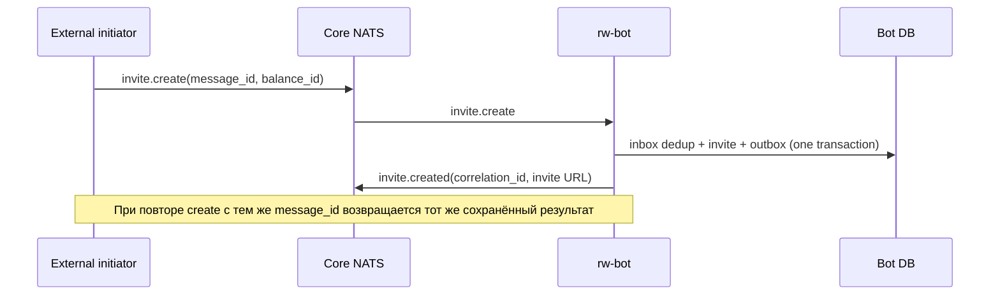
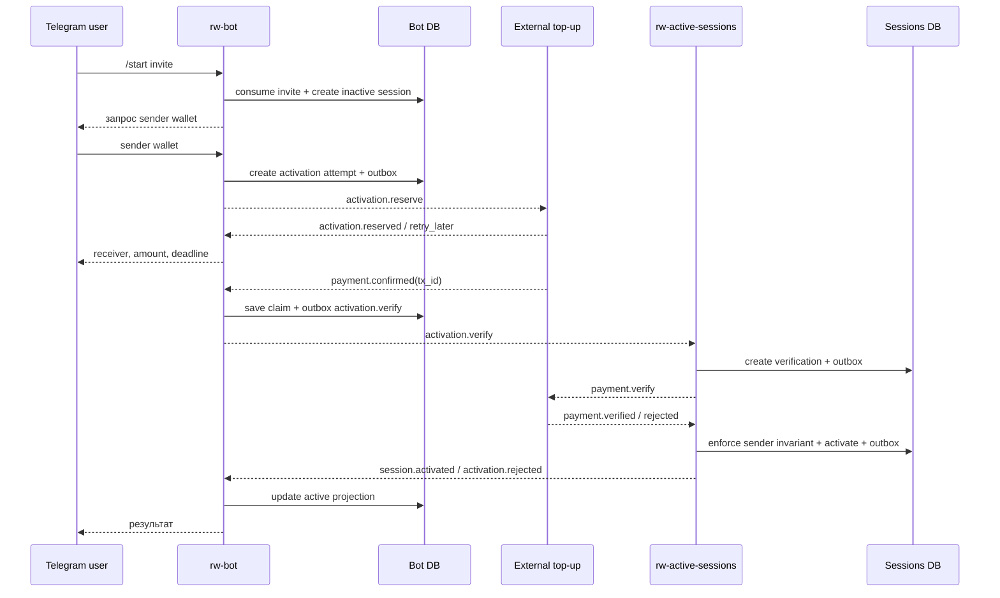
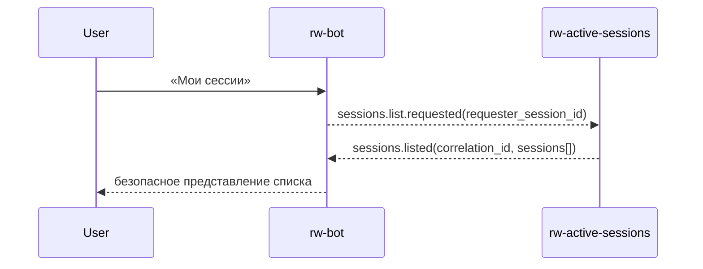
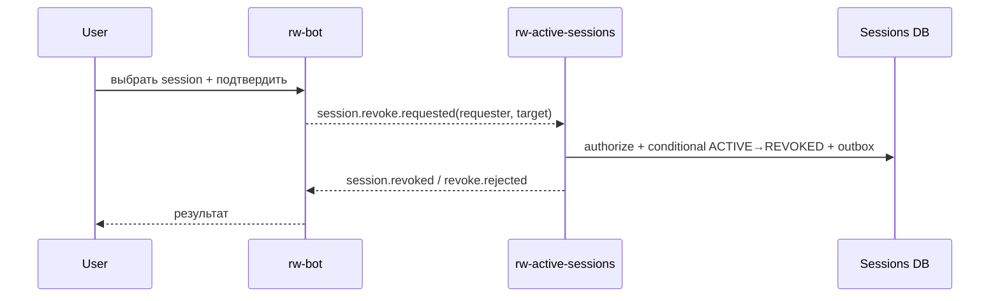
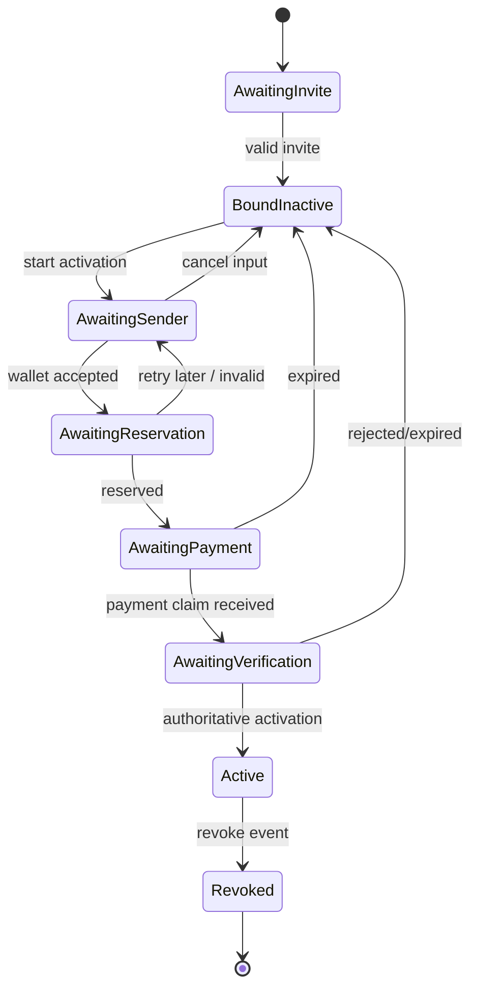
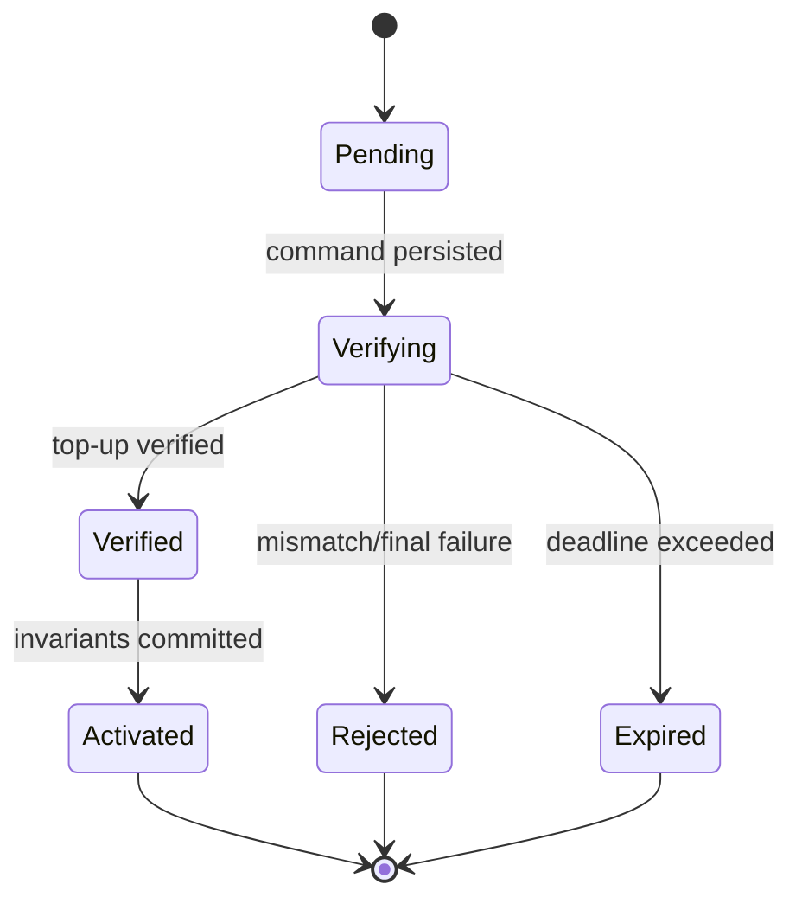

# Сценарии и машины состояний

## Создание invite

## Привязка и активация

Уведомление `payment.confirmed` не активирует сессию напрямую: авторитетное решение появляется только после повторной проверки active-sessions.

## Повторная активация

Повторная активация проходит тот же flow. Active-sessions в одной транзакции блокирует запись balance identity, сравнивает canonical sender wallet с первым значением и только затем создаёт новую active session. Несовпадение публикуется как доменный отказ без изменения сохранённого wallet.

## Список сессий

Bot не строит авторитетный список из своей projection.

## Отзыв сессии

## Состояния сессии бота

Каждый переход выполняется compare-and-set по текущему state/version. Late event допустим только если совпадает `activation_attempt_id` и переход разрешён.

## Состояния проверки активации

Повтор любого входного сообщения возвращает сохранённый terminal result и не повторяет доменный side effect.
